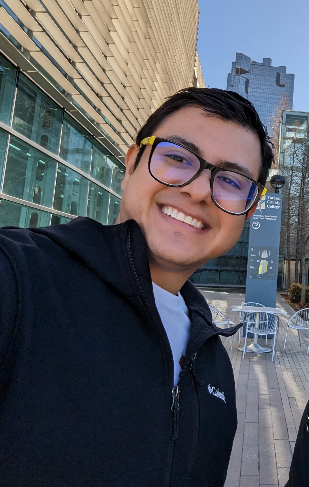

About Us
=========

Ing. Erick Carvajal Barboza, PhD.
*********************************

En 2014 obtuvo el Bachillerato en Ingeniería Eléctrica en la Universidad de Costa Rica en el énfasis de Computadoras y Redes. En 2017 obtuvo una Maestría en Ingeniería Eléctrica en la Universidad de Texas en Austin con especialización en Sistemas y Circuitos Integrados, donde el área principal fue Diseño, Verificación y Prueba de Circuitos Integrados, su supervisor fue el Dr. Jacob Abraham. En 2021 obtuvo un Doctorado en Ingeniería en Computadoras de la Universidad Texas A&M bajo la supervisión del Dr. Jiang Hu y el Dr. Paul Gratz. 

Los pupilos de Erick
********************

Ana Eugenia Sánchez Villalobos

Alex Varela Quirós

Gabriel Alberto Barahona Otoya

Leonardo Serrano Arias

Mike Mai Chen

Daniel Mauricio Chacón Mora

Mauricio Rodriguez Obando

Erick Sancho Alvarado

Bryan Mora Porras
