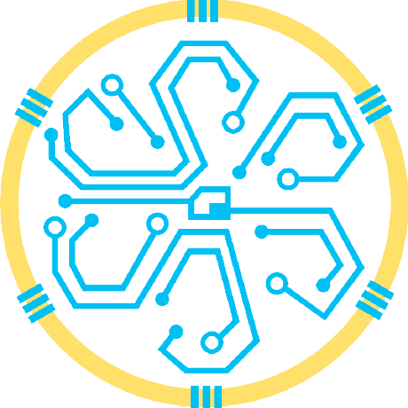

.. raw:: html

    <h1 style="text-align: center; font-size: 48px; color: #1A4C92; font-family: 'Roboto', sans-serif; margin-top: 20px;">
        LIMA-EIE
    </h1>

Bienvenido al Laboratorio de Investigación en Microelectrónica y Arquitectura de computadoras
=============================================================================================

El principal objetivo del laboratorio es el estudio de los procesos de automatización de los flujos de diseño, validación y verificación de circuitos integrados, tanto a nivel de micro-arquitectura, como de diseño lógico y físico.
Actualmente trabajamos en proyectos donde se utilizan algoritmos de aprendizaje automático para acelerar o hacer más precisos cada uno de los pasos del flujo de diseño de circuitos integrados.

.. toctree::
   :maxdepth: 1
   :caption: Contenido:
   :glob:

   proyectos
   tutoriales
   aboutUs

¡Síguenos!
*********

.. raw:: html

   

   - Instagram
     <a href="https://www.instagram.com/lima_eie/?hl=es" target="_blank" rel="noopener noreferrer">
       
       lima_eie
     </a>
   

   

   - GitHub
     <a href="https://github.com/lima-ucr" target="_blank" rel="noopener noreferrer">
       
       lima-ucr
     </a>
   

    
 
    -
     <a href="https://eie.ucr.ac.cr/" target="_blank" rel="noopener noreferrer">
       
       Escuela de Ingenieria Electrica
     </a>
   

